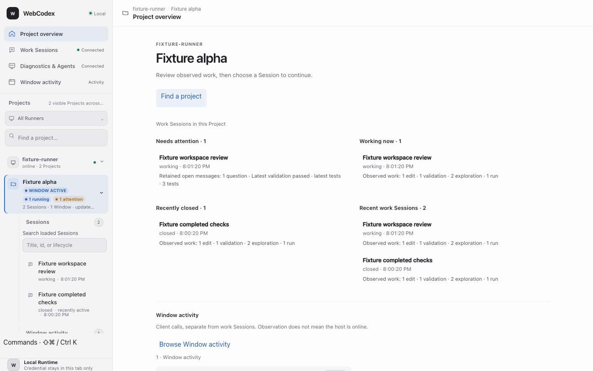
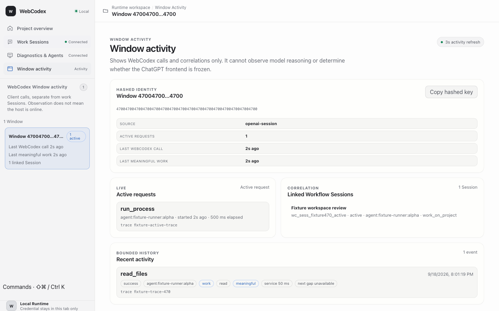
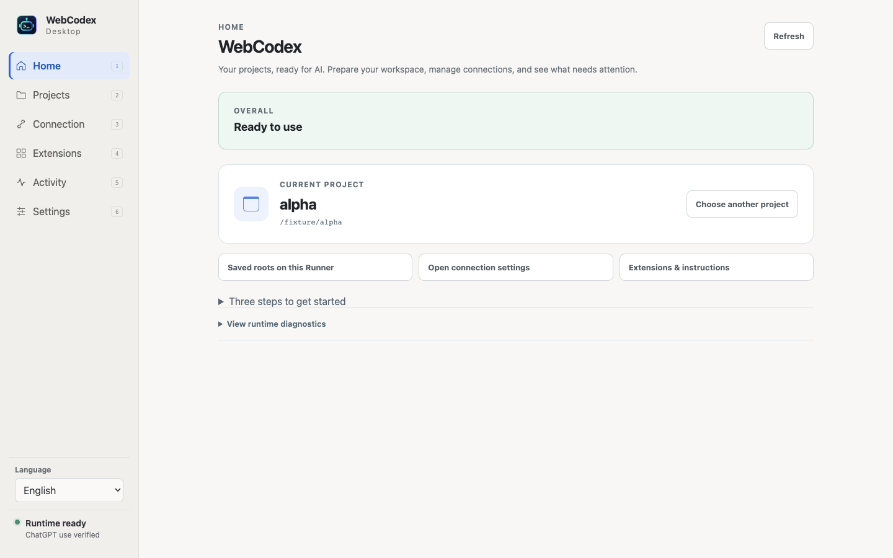
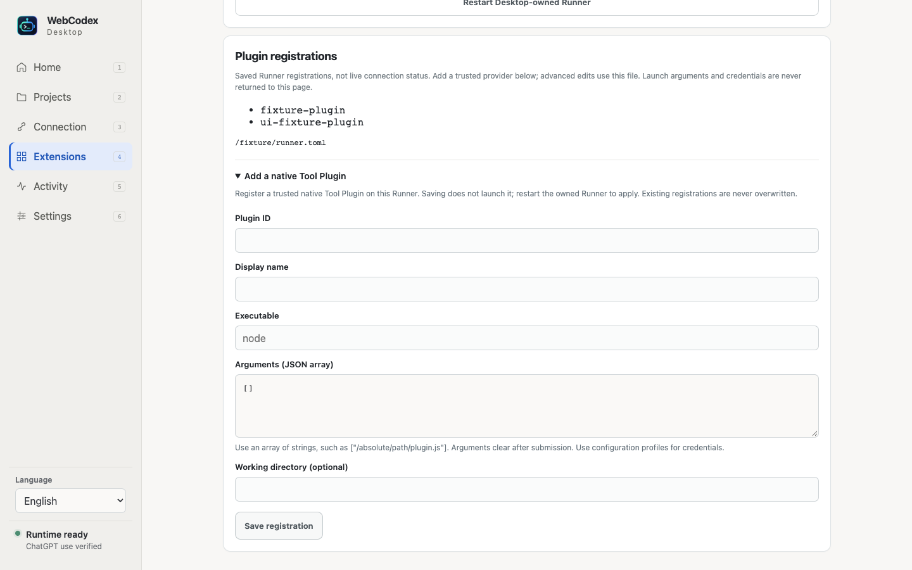
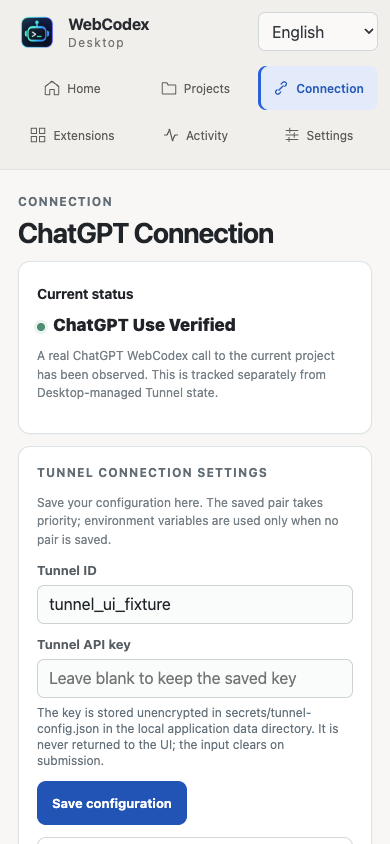
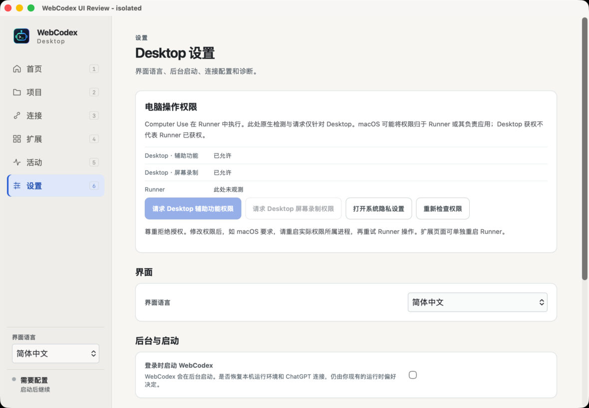

# Issue #470 — daily workspace and Desktop experience

This change implements a project-first WebUI and a reorganized Desktop shell with functional connection and Runner settings. It uses restrained system typography, neutral surfaces, a single selection accent, clear navigation, and progressive disclosure. It does not change Project authority, Workflow Session ownership, or the meaning of Window correlation.

## Delivered journeys

| Journey | Behavior |
| --- | --- |
| Choose work | Project overview summarizes loaded attention, running work, recent closed Sessions, and Window observations. Session selection is explicit. |
| Observe activity | Window activity is a first-class destination, separate from `wc_sess_*` work Sessions. No activity or unavailable observation is not proof of a disconnected or frozen host. |
| Use multiple folders | Saved exact roots are shown per Runner configuration; select/add without another MCP app or a broader filesystem root. |
| Configure a connection | Tunnel ID and write-only API key remain editable while running or stopped. Saving replaces only an active Desktop-owned regular Tunnel. Server and Runner keep running. |
| Recover a connection | Saving configuration and applying it are distinct outcomes. Failed replacement retains the saved values and asks for connection recovery; uncertain process cleanup retains ownership. |
| Configure instructions and extensions | The selected project's conventional AGENTS.md location, global instruction files, Skill roots, and native Plugin registrations share an Extensions page. Saves reject stale configuration targets and preserve unrelated settings. |
| Add a native Plugin | Add an explicit new provider with bounded arguments; existing IDs cannot be overwritten and argument values are not returned by inspection. Apply by explicitly restarting the owned Runner. |
| Authorize Computer Use | A foreground macOS permission explanation provides explicit native request controls. Background launch remains quiet. Desktop permission does not assert Runner permission. |
| Operate with automation | Labeled native inputs/buttons, stable data hooks, keyboard navigation, a command dialog, and focus restoration support Browser Use and Computer Use. |

## Screenshots

The WebUI and browser-rendered Desktop images below use **isolated fixtures**, not a connected user's runtime. They show the actual production bundles. The native macOS screenshot is a real separately identified Tauri test app with fresh application data and no configured runtime.

### Project overview

### Window activity

### Desktop daily use

### Instructions, Skills, and native Plugins

### Narrow connection editor

### Real macOS native settings

## Validation evidence

| Layer | Result |
| --- | --- |
| WebUI TypeScript, build, unit/contract tests | Passed; 178 tests |
| Desktop TypeScript, Vite build, Vitest, form-control CSS contract | Passed; 53 tests |
| Native settings tests | 7 passed: preservation, stale edits/targets, malformed input, Plugin bounds and secret-free projection |
| Native process-supervisor tests | 6 passed |
| Native reconfiguration tests | 2 passed: persisted multi-project inventory and Server/Runner PID preservation during failed Tunnel replacement |
| macOS native build | Dogfood build with embedded production renderer passed |
| Isolated real-browser smoke | 39 checks; 1440/1024/390-pixel layouts; 19 generated screenshots; no page/console errors |
| Browser Use gateway | Opened the fixture, navigated to Connection, and edited its labeled Tunnel ID field |
| Computer Use gateway | Inspected the real native accessibility tree and activated Settings; permission controls/state were exposed correctly |
| Final formatting/whitespace | Cargo formatting check and Git whitespace check passed |

The reproducible browser harness is [`scripts/ui-smoke`](../../../scripts/ui-smoke/README.md). It never invokes real native commands or starts runtime services. Native reconfiguration tests use only explicitly owned fixture processes.

## Boundaries and remaining platform acceptance

Windows-specific compilation, an installed Windows app, and macOS/Windows installer upgrades were **not exercised** on this Mac. The platform-gated source and Windows support remain; platform CI/manual acceptance is still required before release.

The native test launch observed already-granted Desktop permissions. The missing-permission foreground explanation, dismissal, and error/retry behavior were verified in component/browser fixtures. A fresh-denied native TCC grant/restart cycle was not performed, and no system permissions were changed.

No real API key was rotated. The existing Desktop, Server, Runner, and Tunnel were not restarted or replaced. No release, installer publication, deployment, or version bump is part of this change.

The AGENTS.md display is a conventional path, not a file-content editor or an existence claim. Existing Plugin editing/removal and advanced provider fields remain in the displayed Runner configuration file. Saved Plugin IDs do not imply a live or enabled provider. Quick Share uses changed credentials on its next start; automatic replacement applies only to the regular Desktop-owned Tunnel.
